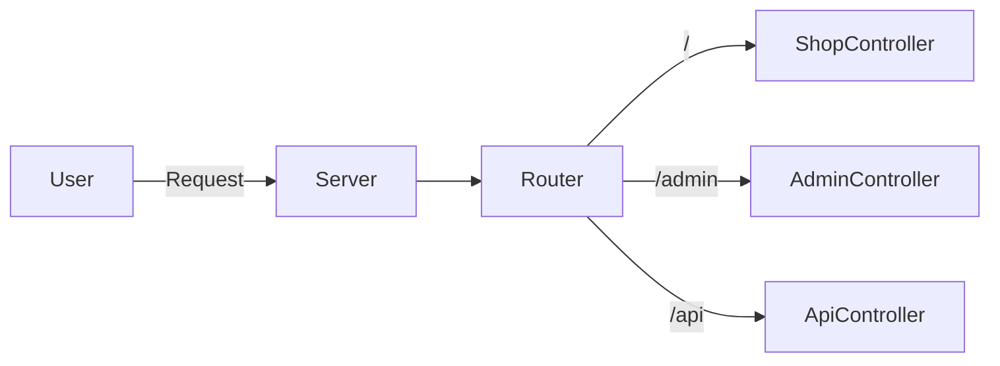
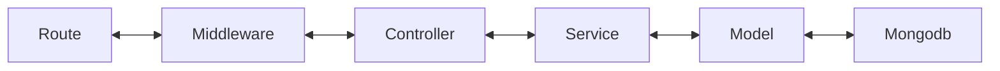

# Simple ecommerce project

## Description

This is a simple ecommerce project. Built for educational purposes with Node.js, Express.js, MongoDB and EJS.

## Technologies

We are using the following technologies:

- Node.js
- Express.js
- MongoDB for database
- Redis for caching
- RabbitMQ for message queue
- mongoose for ODM with MongoDB
- Passport + JWT for authentication/authorization
- EJS for template engine
- Bootstrap for styling
- Docker and Docker Compose for containerization

## Installation and Running

> We use Docker to create infrastructure for MongoDB, Redis and RabbitMQ. If you don't want to use Docker, you can
> install them on your machine.
> If you don't want to use Docker, you can install MongoDB on your machine and change the connection string in the
`.env` file.

### Infrastructure

Build the infrastructure with Docker Compose:

```bash
# Change directory to dev-ops
cd docs/dev-ops

# Run the docker-compose file
docker-compose up -d
```

After running the command, you can access:
- MongoDB at `mongodb://localhost:27017/shop`.
- Redis at `redis://localhost:6379`.
- RabbitMQ at `amqp://localhost:15672`. (username: `admin`, password: `admin`)

### Run application

```bash
# Clone the repository
git clone https://github.com/vanhung4499/shop.git

# Change directory
cd shop

# Create a .env file, change the values if you want
cp .env.example .env

# Install dependencies
npm install

# Run the project
npm start
```

After running the project, you can access it at `http://localhost:3000`.
for admin dashboard, you can access it at `http://localhost:3000/admin`.

TODO: Add swagger for API documentation or attack postman collection.

## Project Structure

This project follows MVC (Model-View-Controller) pattern. Here is the structure of the project:

```bash
src
├── app.js        # Express app
├── index.js      # Entry point of the application
├── common        # Common files like constants, enums, etc.
├── config        # Configuration files like database, logger, etc.
├── controllers   # Controllers for handling requests
├── converters    # Converters for converting data between layers
├── jobs          # Jobs for handling background tasks
├── listeners     # Listeners for consuming messages from RabbitMQ
├── middlewares   # Middlewares like authentication, authorization, etc.
├── models        # Mongoose models to interact with MongoDB
├── routes        # Routes for the application
├── services      # Business logic
├── utils         # Utility functions
├── validations   # Request validations for validating requests data
└── views         # EJS views
```

### Routes

I split the routes into 3 main parts:

- `/`: for shop pages like home, products, product detail, cart, checkout, etc.
- `/admin`: for admin pages like login, dashboard, products, etc.
- `/api`: for API routes like products, users, etc.



### Workflow of a Request

See this diagram to understand the workflow of a request:



1. Route: The request comes to the route, match the route path and transfer to the middleware.
2. Middleware: Handle the request, validate the request data, etc. Then transfer to the controller. (this is optional)
3. Controller: Handle the request, call the service to process the business logic.
4. Service: Process the business logic, call the model to interact with the database.
5. Model: Interact with the database (MongoDB in this case).

### Web Pages and Admin Dashboard

This project has 2 main parts: shop and admin.

- Shop is a shopping website for customers, they can view products, add products to cart, checkout, etc.
- Admin is a dashboard for admin, they can manage products, orders, etc.

When users access the website, express will render the EJS views in the `views` folder.

We split the controller to 2 types. Return JSON for API and render EJS views for web pages.

We should limit render the ejs views in the controller. Instead of it, we create more api for the web pages to call by
ajax and get the data.

> For now, project are in development. We will update more features in the future.

### Development

TODO: Deploy the project to a server, maybe use a cloud provider like Heroku, AWS, etc.\

### References

- [Node.js](https://nodejs.org/)
- [Express.js](https://expressjs.com/)
- [MongoDB](https://www.mongodb.com/)
- [Mongoose](https://mongoosejs.com/)
- [EJS](https://ejs.co/)
- [Bootstrap](https://getbootstrap.com/)
- [Docker](https://www.docker.com/)
- [Docker Compose](https://docs.docker.com/compose/)
- [RabbitMQ](https://www.rabbitmq.com/)
- [Redis](https://redis.io/)
